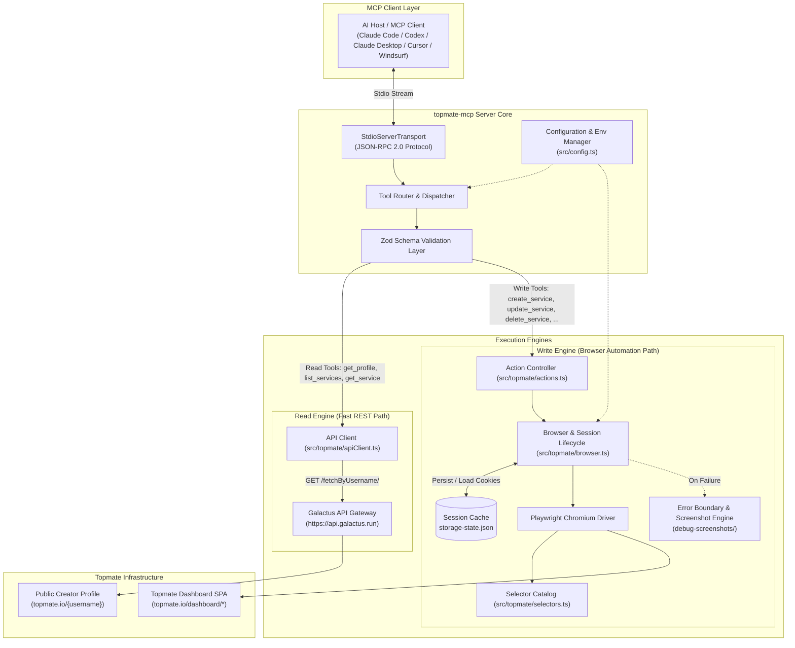
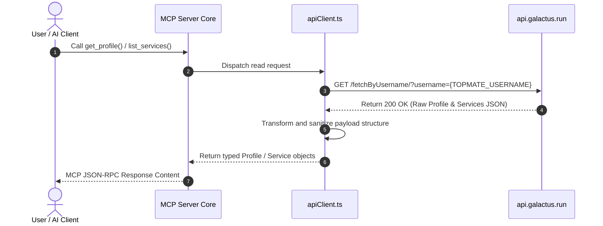
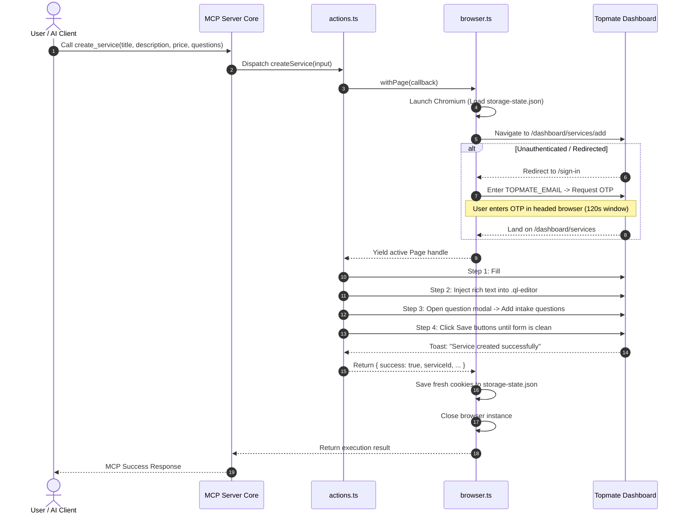
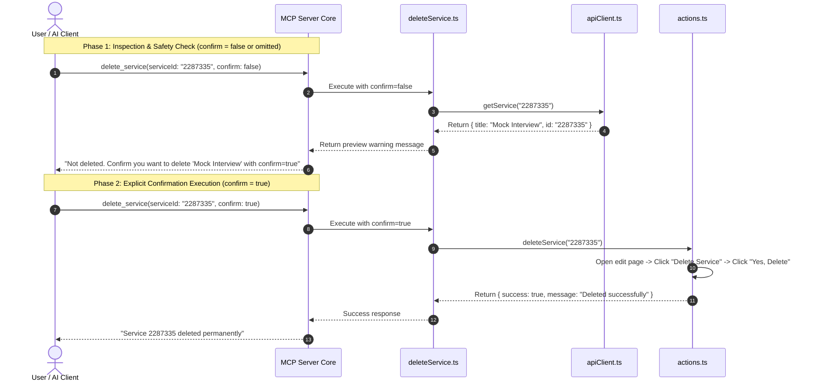

<div align="center">

# topmate-mcp

**Manage, optimize, and scale your [Topmate.io](https://topmate.io) creator profile directly from Claude Desktop, Claude Code, Codex, Cursor, Windsurf, and any Model Context Protocol (MCP) client.**

[](https://www.typescriptlang.org/)
[](https://nodejs.org/)
[](https://modelcontextprotocol.io/)
[](https://playwright.dev/)
[](LICENSE)
[](CONTRIBUTING.md)
[](https://github.com/priyanshu-arya/Topmate-MCP/issues)

<p align="center">
  <a href="#what-it-does">What It Does</a> •
  <a href="#architecture--working-design">Architecture & Working Design</a> •
  <a href="#quickstart">Quickstart</a> •
  <a href="#client-configuration">Client Configs</a> •
  <a href="#efficiency-and-best-practices">Efficiency & Pro-Tips</a> •
  <a href="#tool-reference">Tool Reference</a> •
  <a href="#contributing--extending">Contributing</a> •
  <a href="#troubleshooting--faq">Troubleshooting</a>
</p>

---

</div>

## What It Does

`topmate-mcp` connects any MCP-compatible AI assistant directly to your **Topmate.io** creator profile — no vendor lock-in, since it's a standard [Model Context Protocol](https://modelcontextprotocol.io/) server.

Instead of manually navigating web forms, drafting intake questions from scratch, or copy-pasting descriptions across dashboard tabs, you can manage your entire consulting and mentorship catalog through natural language prompts.

```
+----------------------------------------------------------------------------------------+
| User: "Audit my current Topmate offerings. Then add a 45-min System Design Mock        |
|        Interview priced at INR 1,499. Write a polished syllabus and 3 intake questions."|
+-------------------------------------------+--------------------------------------------+
                                            |
                                            v
+----------------------------------------------------------------------------------------+
| 1. Reads profile & tone context instantly (Zero-Auth Galactus REST API)                |
| 2. Drafts high-converting markdown copy, syllabus structure, and intake questions      |
| 3. Drives Playwright browser instance into dashboard to execute creation live          |
| 4. Returns published Topmate service metadata ready to share                           |
+----------------------------------------------------------------------------------------+
```

### Core Capabilities

- **Tone-Matched Service Creation**: Reads your current bio and services first, then drafts new services that match your personal voice, formatting structure, and pricing tiers.
- **Zero-Auth Instant Reads**: Queries your public creator profile and service listings in sub-second time directly from Topmate's public data endpoint without browser overhead.
- **Automated Dashboard Operations**: Headless browser engine manages multi-step dashboard wizards, Quill rich-text editors, duration pickers, and modal windows.
- **Intake Question Engineering**: Eliminates low-context client bookings by generating tailored intake questions during service creation or updating existing ones.
- **Two-Step Safety Deletion Gate**: `delete_service` previews targeted services first and strictly requires explicit confirmation (`confirm: true`) before executing irreversible deletions.
- **Persistent Session Storage**: Performs a one-time OTP login via email and caches your authenticated session state to `storage-state.json` for subsequent background runs.

---

## Architecture & Working Design

Topmate does not provide a public developer API with write access. `topmate-mcp` addresses this through a **hybrid dual-engine architecture** that separates high-speed public reads from resilient browser-automated dashboard writes.

### System Architecture Diagram



---

### Component Breakdown

#### 1. MCP Protocol & Dispatch Layer (`src/index.ts`, `src/tools/`)
- Implements `@modelcontextprotocol/sdk` over a standard input/output (`stdio`) transport.
- Tools register rigorous `zod` schemas that define input types, parameter descriptions, and validation rules.
- Isolates incoming requests, handles asynchronous execution, and standardizes output serialization into MCP text format.

#### 2. Read Engine (`src/topmate/apiClient.ts`)
- **Transport**: Standard HTTP `fetch` client.
- **Target**: `https://api.galactus.run/fetchByUsername/?username={TOPMATE_USERNAME}`.
- **Characteristics**: Sub-second execution, zero browser resource consumption, no authentication required.
- **Responsibility**: Retrieves complete profile metadata, existing services, descriptions, pricing, duration, and configured intake questions.

#### 3. Write Engine (`src/topmate/browser.ts`, `src/topmate/actions.ts`)
- **Transport**: Playwright Chromium automation driver.
- **Target**: Topmate Dashboard Single-Page Application (`https://topmate.io/dashboard/*`).
- **Characteristics**: Headless or headed browser execution with stateful DOM interaction.
- **Capabilities**:
  - Directs multi-step creation wizards (`/dashboard/services/add`).
  - Interacts with Quill rich-text editors (`.ql-editor`) by focusing, selecting all, and typing content.
  - Dynamically detects and clicks multi-section save triggers.
  - Manages modal dialogues for service intake questions (`.ant-modal-content`).

#### 4. Session & Authentication Lifecycle Manager
- **Storage**: `storage-state.json` (git-ignored, local sensitive store).
- **Strategy**:
  1. Inspects local filesystem for existing `storage-state.json`.
  2. Spawns browser context with pre-loaded cookies and local storage.
  3. Navigates to dashboard; monitors for client-side redirection to `/sign-in`.
  4. If redirection occurs (session expired or initial run):
     - In **headed mode (`HEADLESS=false`)**: triggers email OTP dispatch and yields up to 120 seconds for manual OTP entry.
     - In **headless mode (`HEADLESS=true`)**: fails fast with clear instructions to run headed once.
  5. Upon successful dashboard verification, serializes updated cookies back to `storage-state.json`.

#### 5. Selector Engine & Failure Diagnostics (`src/topmate/selectors.ts`)
- Decouples all DOM element selectors from execution logic.
- Employs visibility-aware selectors (e.g. `button:has-text("Add New"):visible`) to avoid hidden mobile DOM duplicates.
- **Error Boundary**: If any DOM action times out or fails, the engine intercepts the exception, captures a full-viewport screenshot to `debug-screenshots/error-<timestamp>.png`, and attaches the path to the error payload.

---

### Detailed Execution Workflows

#### Sequence 1: Read Workflow (Sub-Second API Resolution)



#### Sequence 2: Write Workflow (Browser Lifecycle & Form Automation)



#### Sequence 3: Two-Phase Deletion Confirmation Workflow



---

## Quickstart

### Prerequisites

- **Node.js**: `v18.0.0` or higher ([Download Node.js](https://nodejs.org/))
- **npm**, **pnpm**, or **yarn**
- A **Topmate.io** creator account

---

### Installation

```bash
# 1. Clone repository
git clone https://github.com/priyanshu-arya/Topmate-MCP.git
cd topmate-mcp

# 2. Install dependencies and Playwright browser binary
npm install
npx playwright install chromium

# 3. Create local environment configuration
cp .env.example .env
```

---

### Configuration (`.env`)

Configure your Topmate credentials in `.env`:

```ini
# Required: Topmate account login email (used for OTP sign-in)
TOPMATE_EMAIL=your-email@example.com

# Required: Topmate creator username (topmate.io/your_username)
TOPMATE_USERNAME=your_username

# Set to false on initial run or session expiration to input OTP in browser
# Switch to true once storage-state.json is generated
HEADLESS=true

# Endpoints (Defaults)
TOPMATE_BASE_URL=https://topmate.io
TOPMATE_API_BASE_URL=https://api.galactus.run
```

---

### Initial Authentication Setup

Topmate uses one-time email OTP authentication. For initial setup:

1. In `.env`, set `HEADLESS=false`.
2. Build the server: `npm run build`.
3. Trigger any write tool (e.g. `create_service`) via your MCP client.
4. A Chromium browser window will appear and submit your email.
5. Check your email inbox, enter the 6-digit OTP into the browser window, and click **Login**.
6. The session is cached to `storage-state.json`.
7. Revert to `HEADLESS=true` in `.env` for background automation.

---

## Client Configuration

Every client ultimately just needs to run `node /ABSOLUTE/PATH/TO/topmate-mcp/dist/index.js` as an MCP server over stdio. Click your client below for its exact config.

<details>
<summary><strong>Claude Code (CLI / Terminal)</strong></summary>

**Option A: Quick add command**
```bash
claude mcp add topmate node /ABSOLUTE/PATH/TO/topmate-mcp/dist/index.js
```

**Option B: `.claude.json` / `settings.json`**
```json
{
  "mcpServers": {
    "topmate": {
      "command": "node",
      "args": ["/ABSOLUTE/PATH/TO/topmate-mcp/dist/index.js"]
    }
  }
}
```
</details>

<details>
<summary><strong>Claude Desktop</strong></summary>

Add to your configuration file:
- **macOS**: `~/Library/Application Support/Claude/claude_desktop_config.json`
- **Windows**: `%APPDATA%\Claude\claude_desktop_config.json`
- **Linux**: `~/.config/Claude/claude_desktop_config.json`

```json
{
  "mcpServers": {
    "topmate": {
      "command": "node",
      "args": ["/ABSOLUTE/PATH/TO/topmate-mcp/dist/index.js"]
    }
  }
}
```
</details>

<details>
<summary><strong>Cursor IDE</strong></summary>

1. Navigate to **Cursor Settings** -> **Features** -> **MCP Servers**.
2. Select **+ Add New MCP Server**.
3. Input:
   - **Name**: `topmate`
   - **Type**: `command`
   - **Command**: `node /ABSOLUTE/PATH/TO/topmate-mcp/dist/index.js`
4. Or configure `.cursor/mcp.json`:
```json
{
  "mcpServers": {
    "topmate": {
      "command": "node",
      "args": ["/ABSOLUTE/PATH/TO/topmate-mcp/dist/index.js"]
    }
  }
}
```
</details>

<details>
<summary><strong>Windsurf IDE</strong></summary>

Add to `~/.codeium/windsurf/mcp_config.json`:

```json
{
  "mcpServers": {
    "topmate": {
      "command": "node",
      "args": ["/ABSOLUTE/PATH/TO/topmate-mcp/dist/index.js"]
    }
  }
}
```
</details>

<details>
<summary><strong>Other MCP-compatible clients / custom agents</strong></summary>

Any host that speaks MCP over stdio works the same way. For a generic runner:

```bash
npx @modelcontextprotocol/cli /ABSOLUTE/PATH/TO/topmate-mcp/dist/index.js
```

Or via JSON config, passing env vars directly instead of relying on `.env`:

```json
{
  "mcpServers": {
    "topmate": {
      "command": "node",
      "args": ["/ABSOLUTE/PATH/TO/topmate-mcp/dist/index.js"],
      "env": {
        "TOPMATE_EMAIL": "your-email@example.com",
        "TOPMATE_USERNAME": "your_username",
        "HEADLESS": "true"
      }
    }
  }
}
```
</details>

---

## Efficiency and Best Practices

### 1. Style-Priming Pattern (One-Shot Learning)
Always instruct the model to call `get_profile` before drafting new offerings. By reading existing services, the model learns your exact tone, formatting structure, emoji preferences, and pricing tiers without repetitive prompt instructions.

### 2. Draft-First, Write-Second Workflow
Browser automation requires several seconds per action. Ask the model to draft titles, descriptions, and intake questions in the conversation first. Once reviewed and refined, approve the final tool invocation.

### 3. Intake Question Optimization
Structure intake questions around three core archetypes:
- **Goal Clarification**: Identifies what the buyer wants to achieve.
- **Context Artifact**: Requests relevant links (resume, portfolio, codebase, design file).
- **Key Blocker**: Focuses the live call on the customer's primary bottleneck.

### 4. Headless Execution Speed
Maintain `HEADLESS=true` for regular usage. Headless execution eliminates GUI rendering overhead and accelerates browser automation cycles.

---

## Tool Reference

### Read Tools (Public API)

| Tool Name | Parameters | Return Schema | Purpose |
|:---|:---|:---|:---|
| `get_profile` | *None* | `Profile` | Fetches creator bio, tagline, social links, and complete service catalog. |
| `list_services` | *None* | `Service[]` | Lists all active services with IDs, pricing, descriptions, and questions. |
| `get_service` | `serviceId: string` | `ServiceDetail` | Fetches complete metadata for a specific service ID. |

---

### Write Tools (Browser Automation)

| Tool Name | Parameters | Safety Protocol | Purpose |
|:---|:---|:---:|:---|
| `create_service` | `title: string`<br>`description: string`<br>`price?: number`<br>`currency?: string`<br>`durationMinutes?: number`<br>`questions?: string[]` | Direct Execution | Creates a new service and configures pricing, duration, description, and intake questions. |
| `update_service` | `serviceId: string`<br>`title?: string`<br>`description?: string`<br>`price?: number`<br>`durationMinutes?: number`<br>`questions?: string[]` | Direct Execution | Applies partial or full updates to an existing service. |
| `update_questions` | `serviceId: string`<br>`questions: string[]` | Direct Execution | Replaces the complete set of intake questions for a service. |
| `delete_service` | `serviceId: string`<br>`confirm: boolean` | Two-Step Confirmation Gate | Permanently deletes a service. Requires `confirm: true` to execute. |
| `update_profile` | `title?: string`<br>`description?: string` | ⚠️ Not working yet | Registered, but the profile editor is an iframe-based page builder with no confirmed selectors — see [Known Limitations](#troubleshooting--faq). Calls will fail until this is fixed. |

---

## Example Prompts & Use Cases

### Service Creation with Syllabus
> *"Review my profile using `get_profile`. Then create a 45-minute service called 'System Architecture Review' priced at INR 1,999. Include a detailed syllabus in markdown with bullet points and configure 3 intake questions."*

### Offering Audit & Gap Analysis
> *"Run `get_profile` and provide a structured audit of my current services. Identify any missing pricing tiers or duration gaps and propose 2 complementary offerings."*

### Intake Question Refactoring
> *"Retrieve my 'Resume Review' service and rewrite the intake questions to ask for their target role, LinkedIn URL, and their top 2 career questions."*

---

## Selector Debugging & Self-Healing

When a browser automation action fails, `topmate-mcp` captures a full-viewport screenshot to `debug-screenshots/error-<timestamp>.png`.

```
[Write Action Fails] ──> [Screenshot Captured] ──> [Run Playwright Codegen] ──> [Update selectors.ts]
```

### Recording Selectors with Playwright Codegen

```bash
npx playwright codegen https://topmate.io/dashboard/services
```

1. Log into Topmate in the launched browser.
2. Click through the target workflow (e.g. "+ Add New" or "Edit Question").
3. Inspect the selector generated by Playwright.
4. Update the corresponding entry in [src/topmate/selectors.ts](file:///Volumes/Working/MCP/topmate-mcp/src/topmate/selectors.ts).
5. Compile with `npm run build`.

---

## Contributing & Extending

This is an open-source project and contributions are welcome — bug reports, selector fixes, and new tools alike. See [CONTRIBUTING.md](CONTRIBUTING.md) for the full guide (coding conventions, how to open a PR, and how to safely verify a browser-automation change against a live account).

### Development Setup

```bash
# Clone repository
git clone https://github.com/priyanshu-arya/Topmate-MCP.git
cd topmate-mcp

# Install dependencies
npm install
npx playwright install chromium

# Start TypeScript compiler in watch mode
npm run dev
```

---

### Project Structure

```
topmate-mcp/
├── src/
│   ├── index.ts                # Entrypoint & tool registration
│   ├── config.ts               # Configuration and environment loaders
│   ├── types.ts                # TypeScript definitions
│   ├── tools/                  # MCP tool definitions with Zod schemas
│   │   ├── createService.ts
│   │   ├── deleteService.ts
│   │   ├── getProfile.ts
│   │   ├── getService.ts
│   │   ├── listServices.ts
│   │   ├── updateProfile.ts
│   │   ├── updateQuestions.ts
│   │   └── updateService.ts
│   └── topmate/
│       ├── apiClient.ts        # Unauthenticated REST client
│       ├── browser.ts          # Playwright lifecycle & session manager
│       ├── actions.ts          # Dashboard browser actions
│       └── selectors.ts        # DOM selector repository
├── debug-screenshots/          # Auto-generated failure snapshots (git-ignored)
├── storage-state.json          # Cached authentication session (git-ignored)
├── .env.example                # Environment variable template
├── package.json
└── tsconfig.json
```

---

### Adding a New Tool

1. Add target DOM selectors to `src/topmate/selectors.ts`.
2. Implement the automation function in `src/topmate/actions.ts` using `withPage(...)`.
3. Create the tool schema wrapper in `src/tools/<toolName>.ts`:
   ```typescript
   import type { McpServer } from "@modelcontextprotocol/sdk/server/mcp.js";
   import { z } from "zod";
   import { myAction } from "../topmate/actions.js";

   export function registerMyTool(server: McpServer) {
     server.tool(
       "my_tool_name",
       "Tool purpose description",
       {
         param: z.string().describe("Parameter description"),
       },
       async (input) => {
         const result = await myAction(input);
         return {
           content: [{ type: "text" as const, text: JSON.stringify(result, null, 2) }],
           isError: !result.success,
         };
       }
     );
   }
   ```
4. Register the tool in `src/index.ts`.
5. Build and verify: `npm run build`.

---

## Troubleshooting & FAQ

### OTP Authentication Timeout
- **Symptom**: `Timed out waiting for login to complete`.
- **Solution**: Set `HEADLESS=false` in `.env`. Run a write tool to open the visible browser window, input the emailed OTP code, and complete sign-in. Once saved to `storage-state.json`, restore `HEADLESS=true`.

### Profile Update (`update_profile`) Behavior
- **Note**: The `/dashboard/profile` route uses a visual iframe page builder with unlabeled toolbar controls. Profile tagline/bio updates are currently under refinement.

### Inspecting Execution Failures
- Review `debug-screenshots/` to inspect the exact DOM state at the time of failure.

---

## License

This project is licensed under the **MIT License**.

*Disclaimer: `topmate-mcp` is an independent open-source tool built on the Model Context Protocol. It is not affiliated with, endorsed by, or sponsored by Topmate.io.*
